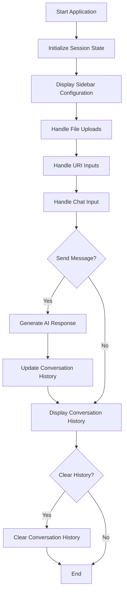
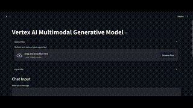

# Vertex AI Multimodal Generative Model

Welcome to the **Vertex AI Multimodal Generative Model** project! This application leverages Google's Vertex AI to create a multimodal generative model capable of processing text, images, audio, and more. The app is built using Streamlit for the frontend interface and is designed to be modular and extensible.

---

## Table of Contents

- [Project Overview](#project-overview)
- [Project Structure](#project-structure)
- [Execution Flow](#execution-flow)
- [Installation](#installation)
- [Usage](#usage)
- [Extension Suggestions](#extension-suggestions)
- [Notes and Warnings](#notes-and-warnings)
- [License](#license)

---

## Project Overview
This project provides an interactive interface for users to interact with a generative AI model. Users can:
- **Upload Files**: Upload images, audio, videos, and other file types.
- **Input URIs**: Provide URIs to resources in Google Cloud Storage.
- **Chat with AI**: Interact with the AI model using text input.
- **Configure Parameters**: Adjust the model's generation parameters via a sidebar.
- **View Conversation History**: Review past interactions and manage session state.

---

## Project Structure

```
vertexai
├── main.py
├── config.py
├── requirements.txt
├── components
│   ├── chat_input.py
│   ├── conversation_history.py
│   ├── file_upload.py
│   ├── sidebar.py
│   └── uri_input.py
├── etc
│   └── secrets
│       └── google_adc.json
├── models
│   ├── generative_model_wrapper.py
│   └── __init__.py
└── utils
    └── session_state.py
```

- **main.py**: The main entry point of the Streamlit application.
- **config.py**: Contains configuration variables like project IDs.
- **models/**: Contains model-related code.
  - **generative_model_wrapper.py**: Wraps the Vertex AI Generative Model.
- **utils/**: Utility functions and session state management.
  - **session_state.py**: Initializes and manages Streamlit's session state.
- **components/**: Streamlit UI components split by functionality.
  - **sidebar.py**: Sidebar for configuration.
  - **file_upload.py**: Handles file uploads.
  - **uri_input.py**: Handles URI inputs.
  - **chat_input.py**: Text input for chatting.
  - **conversation_history.py**: Displays conversation history.
- **etc/secrets/**: Contains secret tokens and credentials.
  - **google_adc.json**: Service account credentials.
- **requirements.txt**: Lists all Python dependencies.
- **LICENSE.txt**: License information.
---

## Execution Flow


---

## Sample


--

## Installation

### Prerequisites
    - Python 3.7 or higher
    - Google Cloud Account: With Vertex AI API enabled
    - Service Account Credentials: `google_adc` file with appropriate permissions

### Steps

1. Clone the Repository

    Navigate to your desired directory and clone the repository:

```bash
git clone https://github.com/yourusername/your_project.git
cd your_project
```

2. Create a Virtual Environment

Create and activate a virtual environment to manage dependencies:

- On macOS/Linux:

```bash
python3 -m venv venv
source venv/bin/activate
```

3. Install Dependencies

Install all required Python packages using `requirements.txt`:

```bash
pip install -r requirements.txt
```

4. Set Up Configuration

- Update `config.py`: Replace 'your-google-cloud-project-id' with your actual Google Cloud Project ID.

    In `config.py`, modify the Config class:

    ```kotlin
    class Config:
    BIGQUERY_PROJECT_ID = 'your-google-cloud-project-id'
    ```

5. Run the Application

Start the Streamlit application:

```bash
streamlit run main.py
```

---

## Usage

### Access the Application
Open your web browser and navigate to the URL provided by Streamlit, usually http://localhost:8501.

### Configure the Model
Use the Sidebar to set the system instruction.

Adjust generation parameters such as temperature, top-p, top-k, etc.

### Upload Files
In the Upload Files section, click on "Browse files" to upload images, audio, video, or other supported file types.

### Input URIs
In the Input URIs section, enter URIs pointing to resources in Google Cloud Storage (must start with gs://).

Select the appropriate MIME type for each URI.

### Chat with AI
Use the Chat Input section to type your message or query.

### Send Message
Click on Send Message to generate a response from the AI model.

### View Conversation History
The Conversation History section displays the chat history.

You can clear the history using the Clear All History button.

---

## Extension Suggestions
- Authentication: Implement user authentication to secure the application and personalize user sessions.
- Additional MIME Types: Extend support for more file types, such as documents or spreadsheets.
- Database Integration: Save conversation history and user data to a database like PostgreSQL or Firebase.
- Improved UI/UX: Enhance the user interface with custom styling, themes, or responsive design.
- Logging and Monitoring: Add logging mechanisms and monitoring tools for better error tracking and performance analysis.
- Deployment: Containerize the app using Docker and deploy it on cloud platforms like Google Cloud Run, AWS Elastic Beanstalk, or Heroku.

---

## Notes and Warnings
- Credentials Security: Keep your `google_adc.json` file secure and avoid committing it to version control systems like GitHub.
- API Quotas: Be mindful of Google Cloud's API usage quotas to prevent unexpected charges.
- Data Privacy: Ensure compliance with data protection laws when handling user data and uploaded content.
- Session State: Understand how Streamlit's session state works to maintain consistent user experiences and prevent data loss.

---

## License
This project is licensed under the MIT License. See the LICENSE.txt file for details.
